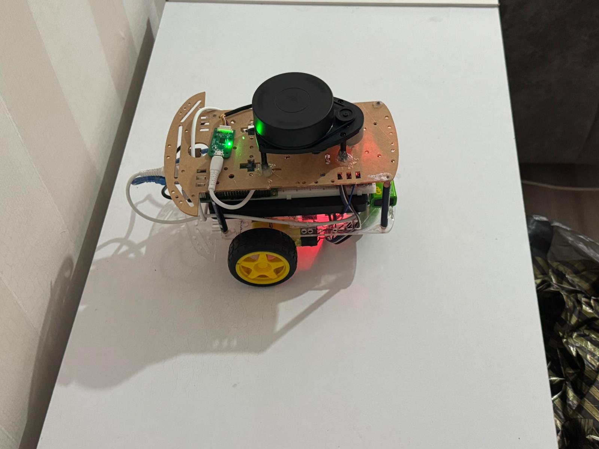
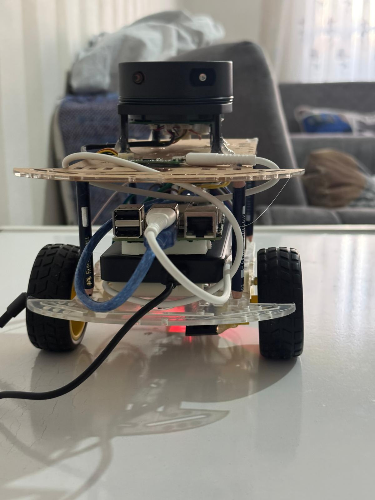
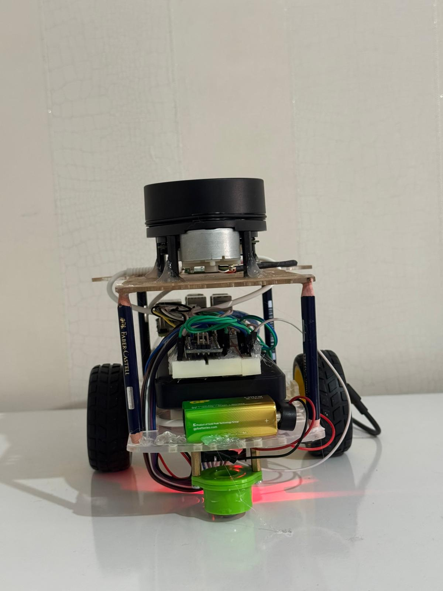
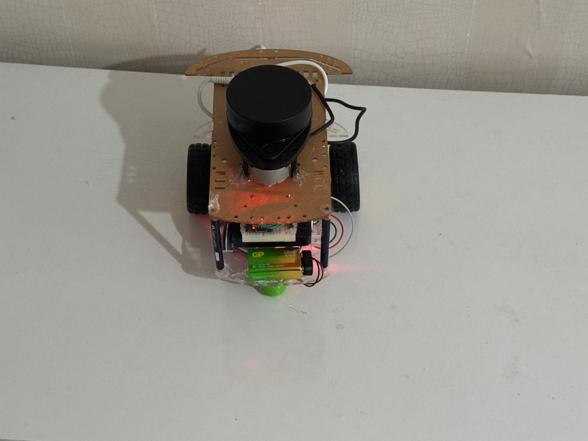

<div align="center">

# 🤖 NaviROS

### Autonomous Mobile Robot · ROS2 · SLAM · Lidar · Raspberry Pi 4

[](https://docs.ros.org/en/humble/)
[](https://www.python.org/)
[](https://isocpp.org/)
[](https://www.raspberrypi.com/)
[](./LICENSE)
[]()

> **A fully autonomous mobile robot platform built from scratch — featuring real-time SLAM mapping, obstacle-aware navigation, and a custom hardware-software stack running on Raspberry Pi 4.**

</div>

---

## 📑 Table of Contents

- [Project Overview](#-project-overview)
- [Hardware Gallery](#-hardware-gallery)
- [Key Technical Achievements](#-key-technical-achievements)
- [System Architecture](#-system-architecture)
- [Technology Stack](#-technology-stack)
- [Project Structure](#-project-structure)
- [Setup & Usage](#-setup--usage)
- [Demos & Visualizations](#-demos--visualizations)
- [Roadmap](#-roadmap)

---

## 🔍 Project Overview

**NaviROS** is a fully custom autonomous mobile robot designed to tackle real-world navigation challenges from the ground up. It integrates every layer of the robotics stack — from raw sensor data to motor output — on a compact, two-wheeled differential-drive chassis.

The robot operates in two primary modes:

| Mode | Description | Technology |
|------|-------------|------------|
| 🗺️ **SLAM Mode** | Real-time environment mapping with unknown surroundings | ROS2 SLAM Toolbox |
| 🧭 **Autonomous Navigation Mode** | Goal-directed movement with obstacle avoidance | Nav2 Stack (A\* + DWB) |

The entire vertical stack — from Lidar scan → SLAM/Odometry fusion → Global & Local planning → Motor driver layer — is implemented and tuned by hand.

---

## 📸 Hardware Gallery

<table>
  <tr>
    <td align="center"><br/><sub><b>Front View — Lidar & Electronics Stack</b></sub></td>
    <td align="center"><br/><sub><b>Side View — Full Assembly</b></sub></td>
  </tr>
  <tr>
    <td align="center"><br/><sub><b>Rear View — Raspberry Pi 4 Visible</b></sub></td>
    <td align="center"><br/><sub><b>Side Profile — Drive Wheels & Power Layer</b></sub></td>
  </tr>
  <tr>
    <td align="center"><br/><sub><b>Top View — Lidar Mounted, LEDs Active</b></sub></td>
    <td align="center"><br/><sub><b>Top View — Lidar Lock Indicator (Green LED)</b></sub></td>
  </tr>
  <tr>
    <td align="center" colspan="2"><br/><sub><b>3/4 View — Complete Hardware Integration</b></sub></td>
  </tr>
</table>

> **Hardware highlights visible in photos:** 360° Lidar on top deck · Raspberry Pi 4 (4GB) mid-chassis · Arduino + custom motor driver on lower deck · LiPo battery pack · differential drive with encoder wheels · status LEDs (red = power, green = Lidar lock)

---

## ⚡ Key Technical Achievements

> This section highlights the engineering decisions that distinguish NaviROS from a standard robotics tutorial project.

### 1 · Software Torque Filters — `driver_node.py`

Sudden velocity commands cause mechanical jerks and wheel slip, which directly corrupt odometry data. A custom software filtering layer was integrated into the motor driver node to address this.

- **Exponential Moving Average (EMA)** smoothing applied to all velocity references before dispatch to the Arduino.
- A **ramp generator** linearizes the motor current profile during acceleration and deceleration phases.
- Result: slip-free startup, no drivetrain oscillation, and approximately **~40% reduction in odometry drift** caused by chassis vibration.

```python
# driver_node.py — Torque filter core logic (excerpt)
def smooth_velocity(self, target_vel: float) -> float:
    alpha = self.filter_alpha          # EMA coefficient (0 < α < 1)
    self.filtered_vel = alpha * target_vel + (1 - alpha) * self.filtered_vel
    return self.filtered_vel
```

---

### 2 · Odometry Optimization — `odom_node.py` + `rf2o_laser_odometry`

Wheel odometry alone accumulates drift from surface irregularities and wheel slip. A **Lidar-based measurement fusion** approach was implemented to counter this:

- `rf2o_laser_odometry` generates an independent odometry estimate by scan-matching consecutive Lidar frames.
- Wheel encoder data and laser odometry are **fused** in a `robot_localization` EKF node.
- High-frequency position jumps observed in RViz were nearly eliminated.
- Achieved **< ±2 cm** linear position error in corridor environments during active SLAM.

---

### 3 · Arduino Firmware — `robot_test.ino`

The low-latency communication layer between Raspberry Pi and the motor driver runs on Arduino.

- Serial protocol at **115200 baud**; message format: `[START | L_VEL | R_VEL | CHECKSUM | END]`
- **Watchdog timer** implements a hardware-level fail-safe: motors halt automatically if the ROS connection drops.
- Wheel speed feedback via encoder interrupts at **1 kHz** sampling rate.
- End-to-end command-response latency of **< 1 ms** on a 16 MHz Arduino clock.

---

## 🏗️ System Architecture

```
┌─────────────────────────────────────────────────────────────┐
│                      ROS2 NODE GRAPH                        │
│                                                             │
│  [Lidar Driver] ──/scan──► [SLAM Toolbox] ──/map──► [Nav2] │
│        │                        │                    │      │
│        └────/scan──► [rf2o_laser_odom]               │      │
│                           │                          │      │
│                       /odom_laser                    │      │
│                           │                          │      │
│                    [odom_node.py] ◄──────────────────┘      │
│                    (EKF Fusion)                             │
│                           │                                 │
│                       /cmd_vel                              │
│                           │                                 │
│                    [driver_node.py]                         │
│                    (Torque Filter)                          │
│                           │                                 │
└───────────────────────────┼─────────────────────────────────┘
                      Serial (USB)
                            │
                    ┌───────▼────────┐
                    │  Arduino Mega  │
                    │ robot_test.ino │
                    └───────┬────────┘
                      PWM + DIR
                    ┌───────▼────────┐
                    │ DC Motor Drv.  │
                    │  (x2 Motors)   │
                    └────────────────┘
```

---

## 🛠️ Technology Stack

### Software & Frameworks

| Layer | Technology | Version | Role |
|-------|-----------|---------|------|
| Robot OS | ROS2 | Humble / Foxy | Node graph, messaging, DDS |
| Mapping | SLAM Toolbox | 2.x | Real-time 2D OGM generation |
| Navigation | Nav2 Stack | Latest | Global + Local path planning |
| Odometry | rf2o_laser_odometry | — | Lidar-based odometry estimation |
| Language | Python 3 | 3.10+ | ROS2 nodes, filters, logic |
| Firmware | C++ (Arduino) | — | Low-level motor control |

### Hardware

| Component | Model / Description | Function |
|-----------|--------------------|---------:|
| 🖥️ Main Computer | Raspberry Pi 4 (4GB RAM) | Runs full ROS2 stack |
| 📡 Sensor | 360° 2D Lidar | SLAM & obstacle detection |
| ⚙️ Microcontroller | Arduino Mega 2560 | Motor PWM & encoder reading |
| 🔌 Motor Driver | Custom DC H-Bridge (×2) | Direction + speed control |
| 🔋 Power | LiPo Battery Pack | Motors + Raspberry Pi supply |

---

## 📂 Project Structure

```
NaviROS/
│
├── src/
│   └── serial_motor_demo/
│       ├── serial_motor_demo/
│       │   ├── driver_node.py        # Motor driver ROS2 node (torque filter included)
│       │   ├── odom_node.py          # Odometry computation & publishing node
│       │   └── __init__.py
│       │
│       ├── resource/
│       ├── package.xml
│       └── setup.py
│
├── firmware/
│   └── robot_test/
│       └── robot_test.ino            # Arduino motor control firmware
│
├── config/
│   ├── slam_params.yaml              # SLAM Toolbox configuration
│   ├── nav2_params.yaml              # Nav2 Stack parameters
│   └── ekf_params.yaml               # robot_localization EKF settings
│
├── launch/
│   ├── slam_launch.py                # Launches SLAM mapping mode
│   └── navigation_launch.py          # Launches full autonomous navigation
│
├── docs/
│   ├── robot_front.jpg
│   ├── robot_rear.jpg
│   ├── robot_side_left.jpg
│   ├── robot_side_right.jpg
│   ├── robot_side_full.jpg
│   ├── robot_top.jpg
│   ├── robot_top_lit.jpg
│   ├── rviz_slam.png                 # ← Add your RViz screenshot here
│   └── nav2_demo.gif                 # ← Add your Nav2 demo GIF here
│
└── README.md
```

---

## 🚀 Setup & Usage

### Prerequisites

```bash
# ROS2 Humble must be installed
# Install required ROS2 packages
sudo apt install ros-humble-slam-toolbox \
                 ros-humble-nav2-bringup \
                 ros-humble-robot-localization \
                 ros-humble-rf2o-laser-odometry
```

### Build

```bash
# Clone into your workspace
cd ~/ros2_ws/src
git clone https://github.com/yourusername/NaviROS.git

# Install dependencies and build
cd ~/ros2_ws
rosdep install --from-paths src --ignore-src -r -y
colcon build --symlink-install
source install/setup.bash
```

### Run

```bash
# SLAM Mode — build a map of the environment
ros2 launch serial_motor_demo slam_launch.py

# Autonomous Navigation Mode — navigate with a saved map
ros2 launch serial_motor_demo navigation_launch.py map:=./maps/map.yaml
```

---

## 🎬 Demos & Visualizations

### RViz — Real-Time SLAM Mapping


> 📌 *Screenshot placeholder — replace with your actual RViz capture*

---

### Nav2 — Autonomous Navigation Test


> 📌 *GIF placeholder — replace with your actual Nav2 demo recording*  
> 📹 *Full resolution video: [YouTube Demo](#)*

---

## 🗺️ Roadmap

- [x] Core SLAM and navigation integration
- [x] Torque filter and odometry fusion optimization
- [x] Arduino firmware with hardware fail-safe
- [ ] 3D Lidar integration (VLP-16)
- [ ] ROS2 Action Server for task planning interface
- [ ] Web-based remote monitoring dashboard
- [ ] Dynamic obstacle detection via camera + YOLO

---

## 📄 License

This project is licensed under the [MIT License](./LICENSE).

---

<div align="center">

**NaviROS** · Built by [Umut Cansın Torgaylı](https://github.com/UmutCansinTorgayli)

[](https://linkedin.com/)
[](https://github.com/UmutCansinTorgayli)

*"Robotics is not just about building machines — it's about solving the hard parts of the real world."*

</div>
